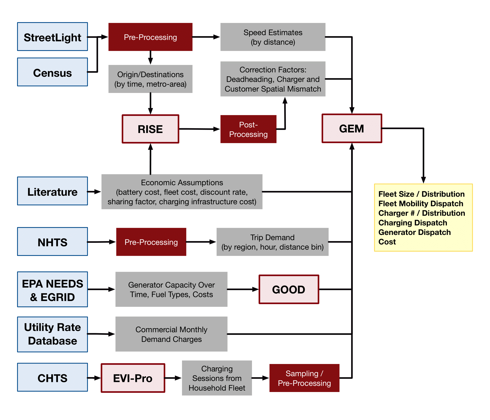
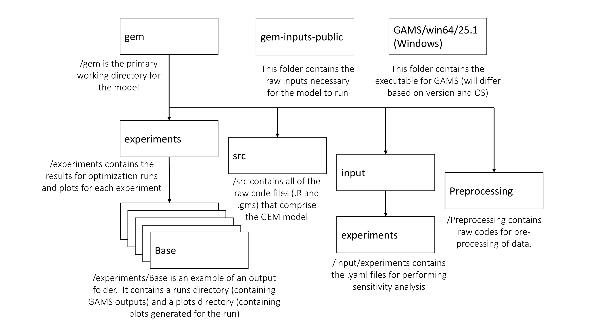

# Grid-integrated Electric Mobility (GEM) Model

## Table of contents

   * [Grid-integrated Electric Mobility (GEM) Model](#grid-integrated-electric-mobility-gem-model)
      * [Table of contents](#table-of-contents)
      * [Platform description](#platform-description)
      * [Installation and setup](#installation-and-setup)
      * [Directory structure](#directory-structure)
      * [Running the model](#running-the-model)
      * [Setting up experiments with .yaml files](#setting-up-experiments-with-yaml-files)
      * [License](#license)

## Platform description

The Grid-integrated Electric Mobility (GEM) model is an open-source modeling platform developed by researchers at Lawrence Berkeley National Laboratory, UC Davis, and UC Berkeley.  This modeling system simulates the operation of both the mobility sector and the electricity sector on a national scale in the United States.  The framework of GEM is unique in that it optimizes the development of a fully autonomous, electric, and shared mobility system while dynamically accounting for the relationship with a high resolution grid model.



For a full description of GEM with in-depth explanation of its optimization structure, please refer to: **paper reference here**

## Installation and setup

GEM is run on both the R platform (https://www.r-project.org/), which acts as a data parser and plotting device for the model. The optimization backbone of GEM employs the General Algebraic Modeling System, also called GAMS (https://www.gams.com/).  While R is an open-source software and readily available, GAMS is a commercial platform and a license is required to operate it.  Additionally, the optimization routine we run in GAMS requires a quadratic convex program solver; we employ CPLEX which also requires a license (https://www.ibm.com/analytics/cplex-optimizer and https://www.gams.com/latest/docs/S_MAIN.html).  It is recommended that the latest versions of both the R and GAMS platform be installed.

GEM requires the following packages in R for its operation: `stringr`, `data.table`, `ggplot2`, `optparse`, `yaml`, `reshape`, `grid`, `gdxtools`, `lubridate`, `RColorBrewer`, `forcats`, `gtools`, `sf`, `cowplot`, `tidyr`, `dplyr`, and `maps`.

Lastly, a .RProfile (see https://support.rstudio.com/hc/en-us/articles/360047157094-Managing-R-with-Rprofile-Renviron-Rprofile-site-Renviron-site-rsession-conf-and-repos-conf) must be initialized to point GEM to pre-specified directories (for the project directory, input files directory, and GAMS executable directory).  The following is an example of defining the directory locations in a .RProfile file:

```
gem.project.directory <- 'relative/path/to/gem/'
gem.raw.inputs <- 'relative/path/to/gem-inputs-public/'
gams.executable.location <- 'relative/path/to/GAMS/win64/25.1/'
```

## Directory structure

The following diagram shows the directory organizational structure of the GEM model:



## Running the model

The GEM model can be fully run in console environment (e.g. cmd.exe in Windows or Terminal in MacOS) using Rscript (https://www.rdocumentation.org/packages/utils/versions/3.6.2/topics/Rscript).  A list of commands can be shown with the help command:

```
Rscript ./src/gem.R --help
```

The help option will display the following message:

```
Usage: gem.R [exp-file]

Options:                                                                                                                                                                                                         
        -p, --plots 
        Only run code that produces plots, requires results to be already present in outputs [default FALSE]

        -t, --notimestamp
        Don't add timestamp to outputs directory [default FALSE]

        -d, --trimdays
        Trim a day off beginning and end of simulation results to avoid edge effects [default FALSE] 

        -e EXP, --experiment=EXP
        Path to experiment file [default input/experiments/base.yaml] 

        -r RUNSUBSET, --runsubset=RUNSUBSET
        Comma separate list of runs to execute [default ]
        
        -o, --overwrite
        Overwrite an existing solution from GAMS [default FALSE]
       
        -h, --help
        Show this help message and exit                                                                                                                                                                                                                 
```

An example base scenario run, using a pre-defined base experiment:

```
Rscript ./src/gem.R -e input/experiments/base.yaml
```

## Setting up experiments with .yaml files

The base configuration has a set of default parameter values with no experimental variation in any of the input parameters.  As a result, the `base.yaml` experiment file is the simplest possible run as follows:

```
Name: Base
Mode: combinatorial
Factors:
  - Name: Base
    Levels:
      - Base
```

Users can choose to conduct a sensitivity analysis on parameter values.  Below is an example of a .yaml file that varies the value of the carbon tax in the model at five different levels.  When this specific experiment file is called, the model will run a total of five times, each with a different value for the carbon tax:

```
Name: carbonTax
Mode: combinatorial
Factors:
  - Name: carbonTax
    Levels:
      - 25
      - 50
      - 100
      - 150
      - 200
```

It is also possible to run a sensitivity analysis across multiple parameters.  Below is an example of three different parameters (fraction of shared, autonomous, and electric vehicles in the model, fraction of privately owned EVs that use smart charging, and a scaling factor for quantity of renewable generation on the electric grid).  When running .yaml experiment files with multiple parameters being varied, it is important to note that the model will run for **every** combination of parameter values (in this case a total of 5x4x2=40 runs):

```
Name: fracSAEVsAndSmartChargingAndRE
Mode: combinatorial
Factors:
  - Name: fractionSAEVs
    Levels:
      - 0.0
      - 0.25
      - 0.5
      - 0.75
      - 1.0
  - Name: fractionSmartCharging
    Levels:
      - 0.0
      - 0.25
      - 0.5
      - 1.0
  - Name: renewableScalingFactor
    Levels:
      - 1.0
      - 3.0
```

## License

See the file LICENSE for the modified BSD license terms.

Copyright notice:

Grid-Integrated Electric Mobility Model (GEM) Copyright (c) 2021, The Regents of the University of California, through Lawrence Berkeley National Laboratory (subject to receipt of any required approvals from the U.S. Dept. of Energy) and University of California, Davis. All rights reserved.

If you have questions about your rights to use or distribute this software, please contact Berkeley Lab's Intellectual Property Office at IPO@lbl.gov.

NOTICE. This Software was developed under funding from the U.S. Department of Energy and the U.S. Government consequently retains certain rights. As such, the U.S. Government has been granted for itself and others acting on its behalf a paid-up, nonexclusive, irrevocable, worldwide license in the Software to reproduce, distribute copies to the public, prepare derivative works, and perform publicly and display publicly, and to permit others to do so.
